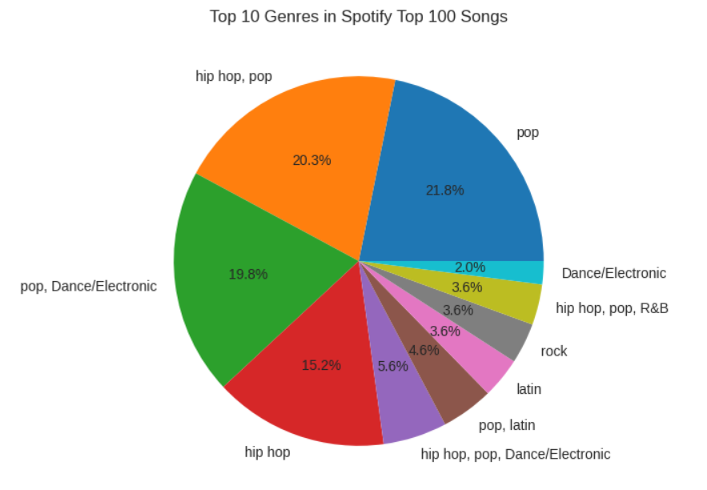

# Clusters K-Means Analysis of Musical Trends on Spotify

## Introduction
This project is part of the Data Mining course, focusing on clustering analysis of Spotify's top trending songs based on their musical attributes. The objective is to discern patterns that might affect song popularity and explore the correlation between various musical characteristics and their impact on song categorization.

## Data Source
We utilize the "Top Hits Spotify from 2000-2019" dataset from Kaggle, which contains over 2000 tracks with detailed attributes including duration, explicit content, year, popularity, and musical features like danceability and energy. The dataset is publicly accessible here: [Top Hits Spotify from 2000-2019](https://www.kaggle.com/datasets/paradisejoy/top-hits-spotify-from-2000-2019).

The genre distribution for the analyzed top songs highlights the diversity of music preferences.

## Data Processing
### Data Cleaning
The initial data processing steps involve identifying and removing any inaccurate or duplicate data using methods such as `isnull()` and `drop_duplicates()`.

### Data Reduction
The focus is narrowed to the data from the years 2017 to 2018, selecting relevant attributes for normalization and clustering.

### Data Normalization
Attributes like `duration_ms`, `popularity`, and `danceability` are scaled to a range of 0-1 to ensure consistency across different scales.

## Models Used
The K-Means Clustering algorithm is employed to group songs based on similarity in their attributes. We determined the optimal number of clusters using the Silhouette method, with evaluations for 2, 3, and 6 clusters. Ultimately, the 6-cluster model was selected for detailed analysis.

## Results
Our clustering analysis results are presented through various visualizations and summarized in tabular form, highlighting the attribute distribution across the clusters.

### Cluster Analysis Visualizations
- **Silhouette Analysis:** We used Silhouette analysis to find the optimal cluster count, confirming that 6 clusters provide clear separations.
  
  
  

- **2017 Cluster Distributions:** Shows the distribution of attributes across clusters for the year 2017.
  

- **2018 Cluster Distributions:** Similar analysis for the year 2018.
  

## Conclusion
The clustering analysis has provided significant insights into the types of songs that trend on Spotify, indicating specific attributes that contribute to their success. This analysis can help artists and producers tailor their music to align with prevailing trends and audience preferences.

## Technologies Used
- **Python** for data processing and analysis.
- **Pandas & NumPy** for data manipulation.
- **Scikit-Learn** for machine learning algorithms.
- **Matplotlib & Seaborn** for data visualization.

## Contributing
Clarissa Sanindita R
Cheria Rindang Tri Andini
Alviatul Nazila
